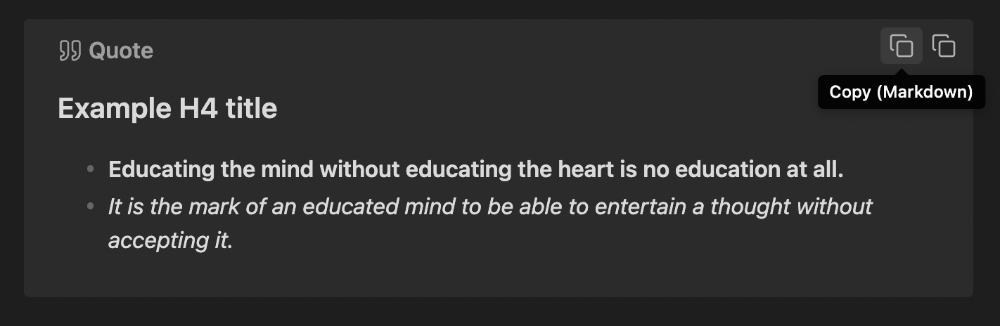
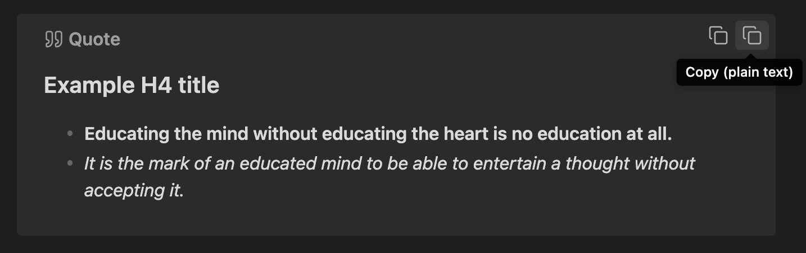

# Callout Copy Buttons

An [Obsidian plugin](https://obsidian.md/plugins?id=callout-copy-buttons) that adds copy buttons to callout blocks in your notes.

## Features

- Adds 'Copy (Markdown)' and 'Copy (plain text)' buttons to callout blocks in your notes.
- Customizable settings to control the appearance and behavior of the copy buttons (e.g., show/hide, format indicators, etc.).
- Reactively syncs the UI with your chosen settings, so you can see how they affect the editor in real-time.

## Usage examples

### Copy (Markdown) button

> [!NOTE]
> Due to technical limitations, 'Copy (Markdown)' buttons are only available in Source Mode and top-level Reading Mode callout blocks (i.e. not in Live Preview callouts, or in nested Reading Mode callouts).

This button copies content in Markdown format, stripping out the callout block syntax.



Clicking 'Copy (Markdown)' above would copy the following content to your clipboard:

```md
#### Example H4 title
- **Educating the mind without educating the heart is no education at all.**
- *It is the mark of an educated mind to be able to entertain a thought without accepting it.*
```

### Copy (plain text) button

This button copies content as plain text (copied directly from the rendered preview), without any Markdown syntax.



Clicking 'Copy (plain text)' above would copy the following content to your clipboard:

```md
Example H4 title
Educating the mind without educating the heart is no education at all.
It is the mark of an educated mind to be able to entertain a thought without accepting it.
```

## Contributing & Feedback

My capacity may be limited for this plugin, but feel free to [open an issue](https://github.com/alythobani/obsidian-callout-copy-buttons/issues) for any bug reports or feature requests and I'll take a look if I do have time. Also feel free to submit a pull request or fork the project.

Have a great day and try to make someone else's day great too! 😊
